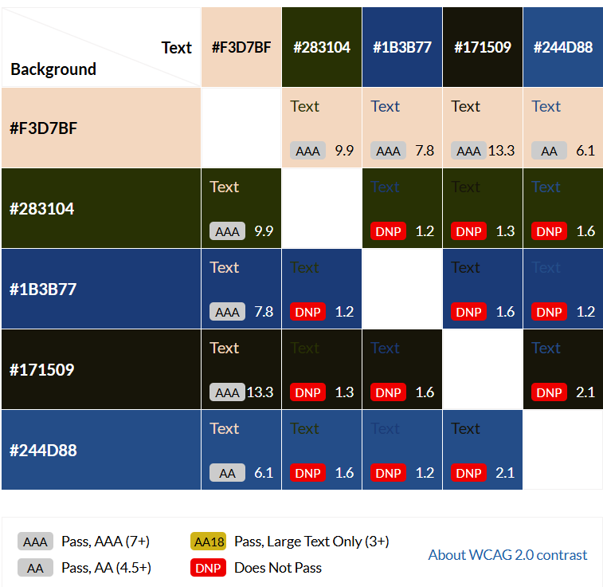

# **Tioman-Island**

**Tioman Island promotion webpage**

This is a promotion webpage for Tioman Island and all the fantastic things you can do there. On this site you can view the beautiful coral reefs, hotels and see what the Island has to offer.
The page has tips and guides you through the Island so you can be prepared when you visit. Along with the amazing sea life and beaches, Tioman has an amazing diverse jungle to explore. The Legend goes that Tioman 
was created when a dragon lay down and died after loosing her partner. This is what makes Tiomans peaks and Island. In the 1600's pirates ravaged the Island for anything they could, including the local people! The 
pirates would then sell the locals into slavery, some of the pirates stayed on the Island and many of the local inhabitants and desendents of them pirates. 

So step into a jungle island adventure and visit Tioman Island. Check out our contact page to get in touch with us.

### Contents

### User Goals

- User friendly navigation
- Non distracting background
- Opertunity to get in touch
- Clear instruction written in English
- Relevent information on the site
- Tips on enjoyable activities and how to stay safe

### User Stories

- As a user, I want to be informed and educated on the Island.
- As a user, I want to see different activities and have local knowledge that's relevent to my enjoyment.
- As a user, I want the instruction and information to be clear and easily understood.
- As a user, I want to see different hotels and aspects of the Island.
- As a user, I want to use my site on different devices.
- As a user, I want to be able to contact the creator for feedback or changes.
- As a user, I want the content to be accessible to anyone with diverse needs.

### Website Goals and Objectives

- Provide knowledge and information reguarding Tioman Island.
- Include various promotional information and images.
- Attract a wide audience, family holidays to Scuba holidays, explorers and nature lovers.
- Provide useful and accurate content so the user gets the most useful information.
- Increase overall website traffic by increasing rankings on search engine.

### Target Audience

- Nature lovers
- Scuba Divers
- Free Divers
- Surfers
- Explorers

### Wireframes

I used balsamiq to make the wireframes on mobile, tablet and laptop. There are some slight differences to the mobile, tablet and laptop wireframes.
It is a one page website to enhance the logical flow. I have included relevent information and a Contact us page for further contact.

### Design Choices

The font family chosen for Tioman Island website was Lato. It is a sans-serif font with a rounded apperance and a modern feel. Lato 
also has a clear and easy to read style, making it suitable for web design and print. 

### Colour Scheme 

The colour scheme chosen based on the background image. All the colours are tropical to match the colours of the Island.

I have also attached a contrast grid to show the possibility of different combinations, these can make the website look 
more visually appealing.

| CSS name | HEX    | Comment           | 
| -------- | ------ | ----------------- |
| Tea Green| #C5DDBB| Background colour |
| Lemon Chiffon | #FDF4C4 | Background colour for the Header |
| Cornflower Blue | #709BFF | Font colour |
| Mint Green | #D6FFFC | Background colour/p |
| Pale Dogwood | #F6D2CB | Background colour for footer/p |

### Images 

I have used a number of images designed to show the best of what the Island has to offer, are visually appealing and can really attract 
people to the Island. I have ised a varerity of images highlighting the vast activities on the Island.

### Responsiveness 

My website is responsive on different layouts and can adapt to different viewports. This allows the website to be viewed as intened 
by the user on different devices and screen sizes. 

### Layout 

The layout is simple and easy to navigate through. Users can easily see the different sections and find the relevent information on the images.
I have chosen alot of images to highlight how visually stunning the Island is and added some information alongside.

# Existing Features 

## Header 

The website Header can fit all device sizes and it contains an image and text. The button is to take you to the contact us section.

### Contact Us button

When clicked on it will take the user to our contact us page where you can inquire about how to book and visit the Island.
You can leave your information and we will get back to you with a relevent responce.

### Landing View 

The website is built on one page to get the best performance. The page consists of images and imformation reguarding the 
Island itself and all the activities available on the Island. The different sections of the website are designed to use 
visual enhancements along side the relevent information, so the user can easily find the correct information with ease.
For consistency the home screen is the same across all devices.

### Footer 

To continue the tropical theme, the footer is very simple and designed with an Island perspective with icons at the bottom that take you to the relevent links.

### 404 page

In a scenario where the link has maybe broken, 404 page has a built in 5 second auto refresh function which returns to the homepage.
It also contains home icon which brings you back to the homepage.

# Technologies Used 

## Languages 

[HTML](https://developer.mozilla.org/en-US/docs/Glossary/HTML5) 

[CSS](https://developer.mozilla.org/en-US/docs/Web/CSS)

# Libraries & Framework

Coolors 
Balsamiq
Google Pics

### Bugs 

The website was throughly tested. 

### Feature testing 

The website was vigoruosly tested for functionality using both Chrome and Edge developer tools.

### Accessibility testing 

I have use the web accessibility tool WAVE which helps determine if the content on the web page is accessible to 
individuals with diverse needs. No issues were raised.

### Lighthouse testing 

The Tioman Island website has been tested in the Chrome Dev Tools and Microsoft Edge Dev Tools using Lighthouse Testing tool which inspects 
and scores the website for the following criteria:

         - Performance-how quickly the website loads and how quickly users can access it.
         - Accessibility-test analyses how well people who use assistive technologies can use you website.
         - Best Practices-checks whether the page is built on the modern standards of web development.
         - SEO-checks if the website is optimised for search engine result rankings.

### Browser Testing 

The Tioman Island website was examined for bugs and malfunctions using a variety of browsers. Opera, Firefox, Google Chrome, and Microsoft Edge were selected for thorough testing. Additionally, I have registered with BrowserStack in order to test my page on both Safari and Internet Explorer. Due to its age, Internet Explorer's initial results were quite subpar. On an iPad and an iPhone, I tested Safari. For the website's final version, no significant problems were discovered on the top 4 browsers. The test findings were verified.

# Deployment 

The Tioman Island website was deployed early in the process to GitHub pages via the following steps:

- Navigate to the repository on GitHub and click on settings.
- Go to navigation and select the pages.
- Go to the none dropdown and choose main.
- Click on the save button.
- the website is now live at [Tioman-Island](https://mikej87.github.io/Tioman-Island/index.html)

  *Any changes required to the website, they can be made, commited and pushed to GitHub.*

  ### To fork the project

  Forking the GitHub repository allows you to create a duplicate of a local repository. This is done so that modifications to the copy can be performed without compromising the original repository.

  - Login to GitHub.
  - Locate the repository.
  - Click to open it.
  - The fork button is located on the right side of the repository menu.
  - To copy the repository to your GitHub account, click the button.

    ### To clone the project

 - Log in to GitHub.
 - Navigate to the main page of the repository.
 - Copy the url for the repository.
  - Open you local IDE.
 - Change the current working directory to the location where you want the cloned directory.
 - Type git clone, and then paste the URL you copied earlier.

   # Credits

   Feedback, advice and support:

   Simen Daehlin
   Rory Patrick Sheridan

   Code inspiration and learning content:

   Love running project

   Visual content:

   Coolors
   Contrast Grid

   Images:

   Google images
    

          

 
